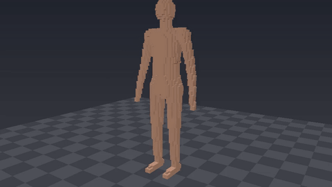
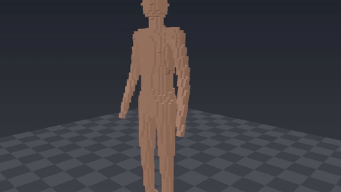
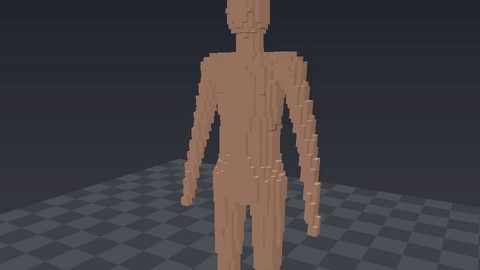
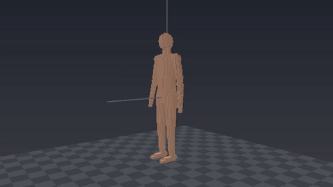

# SARX

**Real-time destructible dynamics for animated characters.**

SARX is an experimental character-physics research project exploring a missing systems problem in real-time graphics:

> Can an ordinarily rigged, animated character transition locally and continuously into deformable, tearing, fracturing, and fully detached physical matter without rebuilding the character from scratch whenever its topology changes?

The long-term target is a game-capable system in which an intact character remains as cheap and controllable as an ordinary animated character, while only damaged regions pay the cost of explicit destructible simulation.

SARX is currently a **deterministic C++20 CPU reference implementation**. It is not yet a production renderer, GPU solver, medical simulator, or finished game middleware.

## Research goal

Existing research has demonstrated many of the hard pieces independently:

- extremely fast destructible voxel/soft-body constraints,
- interactive volumetric cutting, tearing, and excision,
- rig-aware real-time secondary dynamics,
- reduced representations that tolerate moving discontinuities,
- multiresolution soft-body destruction,
- compliant position-based constraints.

SARX investigates the **interfaces between those pieces**.

The project is specifically trying to make this transition well-defined:

~~~text
skeletal animation
        |
        v
compliant rig authority
        |
        v
deformable anatomical volume
        |
   damage / strain
        |
        v
breakable physical topology
        |
        v
dynamic connected components
     /             \
rig-authoritative   free physical island
~~~

The central architectural rule is that **animation, physics, topology, and rendering are separate representations**. A visible character mesh should not have to be the authoritative fracture simulation.

## Research lineage and credit

SARX is an integration/research prototype, not a claim that the underlying techniques originated here.

The project is particularly informed by the following work:

| Research | What SARX takes from it |
| --- | --- |
| Tim McGraw, **Gram-Schmidt Voxel Constraints for Real-Time Destructible Soft Bodies** (MIG 2024), DOI [10.1145/3677388.3696322](https://doi.org/10.1145/3677388.3696322) | Demonstrates that deliberately approximate, regular, breakable PBD constraints can make soft-body destruction fast enough for real-time use. |
| Tim McGraw & Xinyi Zhou, **Real-time voxelized mesh fracture with Gram-Schmidt constraints** (Computers & Graphics 2025), DOI [10.1016/j.cag.2025.104382](https://doi.org/10.1016/j.cag.2025.104382) | Matured breakable voxel constraints, efficient solver partitioning, and LOD constraints for destructible bodies. |
| Xinhao Lin, **Real-Time Soft-Body Destruction with Multiresolution Structure** (Purdue M.S. thesis, 2025), DOI [10.25394/PGS.28724222](https://doi.org/10.25394/PGS.28724222) | Multiresolution and adaptive-detail direction for Gram-Schmidt-style destructible bodies. |
| Tim McGraw & Jack Myers, **Real-Time Dissectible Deformable Models Using High-Performance Breakable Shape Constraints** (HPG 2026), DOI [10.1145/3820013](https://doi.org/10.1145/3820013) | Shows real-time cutting, tearing, and excision on a constrained particle volume while separating physical resolution from high-detail volumetric appearance. |
| Otman Benchekroun et al., **Fast Complementary Dynamics via Skinning Eigenmodes** (SIGGRAPH/TOG 2023), DOI [10.1145/3592404](https://doi.org/10.1145/3592404) | Demonstrates practical rig-aware real-time elastodynamic secondary motion and motivates keeping rig motion and physical detail separable. |
| Yue Chang et al., **Lifting the Winding Number: Precise Discontinuities in Neural Fields for Physics Simulation** (SIGGRAPH 2025), DOI [10.1145/3721238.3730597](https://doi.org/10.1145/3721238.3730597) | Demonstrates that reduced representations can explicitly encode moving cut discontinuities rather than baking a single topology into the representation. |
| Miles Macklin, Matthias Müller & Nuttapong Chentanez, **XPBD: Position-Based Simulation of Compliant Constrained Dynamics** (MIG 2016), DOI [10.1145/2994258.2994272](https://doi.org/10.1145/2994258.2994272) | Mathematical basis for the compliant constraints used throughout the SARX reference solver. |
| Matthias Müller et al., **Position Based Dynamics** (2007), DOI [10.1016/j.jvcir.2007.01.005](https://doi.org/10.1016/j.jvcir.2007.01.005) | Foundational position-based simulation framework. |

The paper catalog, BibTeX file, redistribution notes, vendored open-license material, and local PDF fetch helper live in [papers/](papers/).

### What is specifically SARX's current research glue?

The current prototype is exploring a combination that is not claimed to come directly from any one cited paper:

- **breakable animation authority** rather than animation directly overwriting physics,
- **dynamic rig islands** that lose root authority when both physical and rig connectivity fail,
- a single **deterministic fracture event stream** spanning spatial cuts, structural damage, attachments, joints, and strain-driven failure,
- **momentum-preserving handoff** from rig-influenced motion to free physical islands,
- damage-aware **adaptive simulation domains** built around persistent wounds,
- explicit separation between authoritative CPU semantics and future GPU/renderer representations.

These are implementation/research hypotheses being tested by SARX; they should not be attributed to the cited authors unless a later literature review establishes a direct prior method.

## Methodology

### 1. Animation is an influence, not an overwrite

A bone transform produces a target position. A physical particle is coupled to that target by a compliant XPBD attachment rather than being teleported to it.

~~~text
animation pose -> bone target -> compliant attachment -> physical particle
~~~

Attachments have their own damage state and can fail. A child bone only retains animation authority while its parent-link chain still reaches a rig root.

### 2. Physical topology is independently breakable

The reference body contains several kinds of authoritative physical connectivity:

- structural particle-to-particle constraints,
- tetrahedral signed-volume constraints,
- particle-to-bone attachments,
- radius-bearing parent/child joint capsules.

Each can fail independently.

Physical connected components are recomputed from surviving structural and tetrahedral topology. If a component has no surviving path to a root-authoritative attachment, it becomes a free physical island.

No velocity reset occurs at this transition.

### 3. Damage comes from geometry

SARX does not expose an anatomy-specific command such as sever_arm().

Instead, damage primitives intersect physical representations in world space:

- blade/capsule sweeps,
- spherical impacts,
- structural segments,
- tetrahedral cells,
- attachment segments,
- joint capsules.

The exact router determines contact, material response, accumulated damage, and terminal failure.

A uniform-grid broad phase may reject distant primitives, but it is deliberately **non-authoritative**: full-scan and accelerated routing must produce the same fracture result.

### 4. Tissue can be directional

Materials support:

- cut resistance,
- blunt resistance,
- longitudinal/transverse cut response,
- tensile yield strain,
- tensile break strain,
- progressive strain-damage rate.

Generated anatomical regions can assign both material IDs and rest-space fiber direction.

Structural constraints retain a rest direction. At damage time the fiber is transported from the rest structural axis into the current deformed structural axis before anisotropic cut response is evaluated.

This is a first-order material-frame approximation, not yet a complete continuum deformation-gradient model.

### 5. Volume is explicit

The V0.4B reference no longer relies on diagonal distance links to approximate volume preservation.

A tetrahedral XPBD constraint stores a signed rest volume and solves:

~~~text
C(x) = V_current(x) - V_rest
~~~

using the tetrahedron's volume gradients.

Tetrahedral cells are themselves damageable topology. A cut entering a live cell can deactivate that volume constraint so that volume preservation does not invisibly glue together a severed region.

### 6. Anatomy is generated from geometric regions

The current lattice builder supports overlapping boxes, spheres, and capsules.

Regions have priority and can assign material and fiber orientation. This is enough to build deterministic nested fixtures such as a capsule-shaped muscle containing a higher-priority bone region.

### 7. Expensive simulation should become local

A persistent wound can be expanded by a halo into an **adaptive damage domain** containing only nearby particles, structural links, tetrahedral cells, attachments, and joint capsules.

Today this is a selection/reference mechanism. The next stage will actually schedule the solver over these active domains.

### 8. CPU semantics come first; GPU representation follows

The CPU Body is currently authoritative.

SARX can export a structure-of-arrays mirror containing particle, structural, tetrahedral, bone/joint, and attachment state. That layout is intended to become the input to future GPU compute kernels.

The project will require CPU/GPU numerical and topology parity tests before GPU results become authoritative.

## Current results — V0.5 layered anatomical voxel body

V0.5 adds a second body model, `AnatomyBody` (`include/sarx/anatomy.hpp`), aimed at the level of detail of the dissection work:

- **Anatomy.** A layered humanoid of skin, subcutaneous fat, muscle, tendon, bone, marrow, brain, heart, lungs, liver and gut, with a skull, spine, rib cage, clavicles, scapulae and pelvis. It is driven by a skinned rig.
- **Blades.** Cuts that must be hacked through over several strokes.
- **Bullets.** Rounds that tunnel, shatter bone and exit into the world.
- **Tearing.** Bodies that tear in half.

The V0.4 `Body` (distance links + tets) is unchanged.

| Hack through the torso (180 J chops) | Two-chop arm severance while walking |
| --- | --- |
|  |  |
| **Pistol and rifle rounds** | **Tear-in-half (rig-driven pull)** |
|  |  |

MP4s are in `media/mp4/`. Regenerate them with `python tools/make_anatomy_media.py --demo build/sarx_anatomy_demo`. The demo writes a `summary.json` per scenario, with every blade and bullet event and the energy each spent per tissue.

### What it takes from the literature, and where it departs

- **Constraint layout (Lin 2025, Alg. 2 and §3.6; McGraw 2024).** Each voxel owns 8 corner particles held by a Gram-Schmidt voxel (VGS) shape constraint, and neighbours are joined by zero-rest-length corner bonds. Voxels own their corners, so one iteration is exactly four conflict-free parallel passes (voxels, +x, +y, +z bonds): the GPU partitioning of the thesis. SARX runs these on a CPU worker pool, with bit-identical results for any thread count (tested).
- **Stream compaction (Lin 2025, §3.8).** Only dynamic voxels and live bonds are iterated.
- **SARX departures, found by testing in this repo:**
  1. *Sequential Gram-Schmidt biases rotation.* Building u1 from the already-updated u0 turns the voxel slightly on every projection. Iterated, that ratcheted into spurious spin, and resting blocks folded or exploded; adding iterations made it *worse*. SARX uses a symmetric (Jacobi / Löwdin-style) orthogonalisation.
  2. *Separate α/β/δ relaxation is not contractive.* With a partial edge-length restore and an independent partial volume restore, a 12-voxel resting stack diverged at 4 substeps. SARX projects to the fully converged VGS goal and blends toward it with a per-tissue `shape_stiffness` (standard PBD stiffness).
  3. *Handedness.* VGS as published uses \|det\|, so a voxel crushed through itself stays mirrored and rips its neighbours. SARX re-completes the frame right-handed.
- **SARX additions (not claimed by the cited work):**
  - **Energy-ordered blades.** Bonds are processed in the order the swept edge reaches them, and each spends energy. The blade lodges when the energy runs out, and partial bond damage persists, so the next stroke continues the wound.
  - **Energy-ordered ballistics.** A round's penetration is costed per tissue, reports its exit state, and deposits momentum into the tissue near the wound channel.
  - **Rigid bone fragments.** Shape matching (Müller et al. 2005, rotation extraction Müller et al. 2016) applies per connected bone fragment, so a chopped bone splits into rigid pieces.
  - **Ball joints.** Joints are formed at articulations and release when the articulation is cut.
  - **Hybrid residency.** An intact rig-driven body is kinematic (linear-blend skinned). Only wound halos, grabs and free islands are simulated, and settled islands sleep.
  - **Stability for contact.** Stacking uses mass scaling (Macklin et al. 2014) and per-voxel ground contact, with CFL-style adaptive substeps on *relative* velocity.

### Frame cost

`sarx_anatomy_bench` measures simulation time per 60 Hz frame, with rendering excluded. The numbers below are from a shared 4-vCPU Intel Xeon @ 2.1 GHz container (CPU reference; no GPU). The humanoid is 70.7 kg.

| 2 cm voxels (8,004 voxels / 64k particles / 21k bonds) | avg | p95 | simulated voxels |
| --- | --- | --- | --- |
| intact, walking (hybrid residency) | 0.41 ms | 0.49 ms | 0 |
| after a torso chop + gunshot, walking | 3.6 ms | 4.6 ms | ≤ 1,036 |
| whole body dynamic (worst case) | 12–14 ms | 16–21 ms | 8,004 |
| corpse dropped on the floor, until asleep | 11–16 ms | 16–24 ms | 8,004 → 0 |

At 3 cm voxels (2,399 voxels) the same rows are 0.11 / 3.3 / 4.5 / 2.2 ms. The intended in-game path is the hybrid one: intact characters cost what skinning costs, and a wound pays only for its halo. A fully dynamic 2 cm body is not a 60 fps target on this CPU. That case is what the four-pass GPU layout is for, and GPU kernels are not implemented yet.

### Validated behaviour (`sarx_anatomy_tests`)

| Question | Result |
| --- | --- |
| Is the humanoid layered, with a skin-only outer surface and an adult mass? | **Yes.** All 11 tissues are present; 70.7 kg. |
| Does a resting block stay stable and keep its shape? | **Yes.** No energy gain; >85% height at the default budget. |
| Can a blade lodge, keep partial bond damage, and be continued by later strokes? | **Yes.** A 21 J stroke parts exactly 8 muscle bonds and damages the 9th; four strokes sever. |
| Does bone stop blades? | **Yes.** 70 J severs a muscle bar but lodges in the same bar with a bone core. |
| Does a severed limb lose rig authority and fall, with damage activation staying local? | **Yes.** Exactly one component keeps the rig; fewer than 25% of voxels are activated. |
| Do bullets tunnel, lodge in bone, pass through with a rifle, and deposit bounded momentum? | **Yes.** |
| Is it deterministic across runs and thread counts? | **Yes.** State hashes are identical at 1 and 4 threads. |
| Does sustained pulling tear tissue apart? | **Yes.** |
| Do settled fragments sleep and wake on damage? | **Yes.** |

## Current results — V0.4B

The current reference implementation has validated the following behaviors in automated tests:

| Question | Current result |
| --- | --- |
| Can particles follow animation without direct position overwrites? | **Yes.** Compliant bone-target attachments converge toward animated targets. |
| Can animation authority itself fail? | **Yes.** Attachment and rig-parent links carry independent damage state. |
| Can complete severance create a free component? | **Yes.** Connected-component partitioning produces free dynamic islands when both physical and root-rig paths are lost. |
| Does severance preserve current motion? | **Yes.** Detached island linear momentum is preserved by leaving particle velocities intact. |
| Can a blade cause severance from geometry rather than an anatomy-specific command? | **Yes.** Spatial damage can break structural and rig connectivity automatically. |
| Can materials react differently to the same hit? | **Yes.** Cut/blunt resistance and anisotropic fiber response are tested. |
| Can tissue tear without a weapon event? | **Yes.** Yield/break strain can accumulate progressive damage or cause brittle failure. |
| Can damage be replayed deterministically? | **Yes.** Damage command history preserves event IDs, topology outcomes, and accumulated damage in reference fixtures. |
| Can broad-phase acceleration change the authoritative result? | **No in tested fixtures.** Candidate-restricted and full-scan damage paths are parity-tested. |
| Is volume preservation explicit? | **Yes.** XPBD tetrahedral constraints restore signed rest volume in reference tests. |
| Can a cut release tetrahedral connectivity? | **Yes.** Intersected tets can fail and emit explicit tetrahedral fracture events. |
| Can generated anatomy contain overlapping tissue regions? | **Yes.** Box/sphere/capsule priority and region fibers are tested. |
| Can damage activation stay local? | **Yes as a selector.** Wound-local domains reject distant particles and tets in generated fixtures. |
| Is a GPU-oriented representation available? | **Yes as a mirror.** SoA snapshots are parity-tested against selected authoritative CPU state. |

### Validation status

The V0.4B code-bearing head passed the repository's GitHub Actions matrix on both Ubuntu and Windows:

- **run #107:** configure ✅ build ✅ tests ✅ on Ubuntu and Windows
- **run #111:** final documented V0.4B head also configure ✅ build ✅ tests ✅ on Ubuntu and Windows

These are **correctness/reference results**, not production performance results.

SARX does not yet claim a target FPS, character count, GPU speedup, visual quality level, or superiority to any cited method.

## Current architecture

~~~text
                    skeletal animation
                           |
                    animated bone targets
                           |
                breakable XPBD attachments
                           |
          +----------------+----------------+
          |                                 |
  structural constraints             tetra volume cells
          |                                 |
          +--------------+------------------+
                         |
               deformable physical body
                         |
              spatial / strain damage
                         |
              deterministic events
                         |
          +--------------+----------------+
          |                               |
 surviving root authority          disconnected island
          |                               |
 animated + physical motion          free physical motion

                         |
                  wound descriptors
                         |
              adaptive damage domain
                         |
        future restricted/GPU simulation

render representation: deliberately separate / not implemented yet
~~~

## Build and test

Requirements:

- CMake 3.20+
- a C++20 compiler

~~~bash
cmake -S . -B build -DSARX_BUILD_TESTS=ON
cmake --build build --config Release
ctest --test-dir build -C Release --output-on-failure
~~~

CI currently builds and tests on Ubuntu and Windows.

## Repository layout

~~~text
include/sarx/        public reference APIs
src/                 deterministic CPU reference implementation
tests/               behavioral and parity fixtures
docs/ARCHITECTURE.md detailed architecture notes
papers/              research provenance, citations, PDFs/links
.github/workflows/   CI and licensed-paper vendoring
~~~

## Papers

See [papers/README.md](papers/README.md).

SARX intentionally distinguishes between vendored papers whose redistribution license was verified and linked research copies that are publicly readable but are not automatically re-hosted here.

For private/local study:

~~~bash
python papers/fetch_local.py
~~~

Downloaded non-vendored PDFs go to papers/local/ and are gitignored.

## Limitations

SARX is still a research reference. Current gaps:

- no GPU solver: the V0.5 anatomy layout is GPU-shaped (four conflict-free passes) but runs on CPU threads,
- no volumetric splat or SDF wound renderer: the anatomy renderer draws exposed voxel faces, and the V0.4 glTF path splits meshes by joint branch,
- anatomy contacts are ground + between separate pieces; no self-collision within one connected piece,
- no fluid/blood simulation (blood spray in the demos is presentation particles),
- no full deformation-gradient material frame,
- a limp body standing upright still tears some tissue while it collapses (PBD load paths through ~90 voxels; the skeleton joints mitigate but do not eliminate it),
- the anatomy humanoid is procedural; voxelising the Quaternius glTF character into anatomy is not done yet,
- tissue parameters are gameplay-calibrated, not measured biomechanics.

The reference prioritizes **explicit, testable transition semantics** before optimization.

## Near-term roadmap

1. GPU compute kernels for the V0.5 four-pass anatomy solver (VGS pass, three bond passes), with CPU/GPU parity tests against `state_hash`,
2. voxelise the rigged glTF character into layered anatomy (skin weights from the mesh) so the real walking character can be hacked apart,
3. multiresolution anatomy (Lin 2025): coarse interior voxels that refine around wounds,
4. a surface renderer for the anatomy body (embedded mesh / splats) instead of voxel faces,
5. self-collision within one connected piece, and blood as a fluid,
6. long-range constraints for upright limp bodies.

## Research ethics and attribution

SARX is intended to build *on* prior graphics research, not blur its provenance.

If a technique is directly derived from a paper, that paper should be cited in the implementation/documentation. If an idea is merely inspired by or adjacent to a paper, SARX should say so. New integration ideas should not be retroactively attributed to prior authors, and prior authors' results should not be presented as SARX benchmark results.

If you believe a citation, attribution, license classification, or description of prior work is inaccurate, please open an issue.
